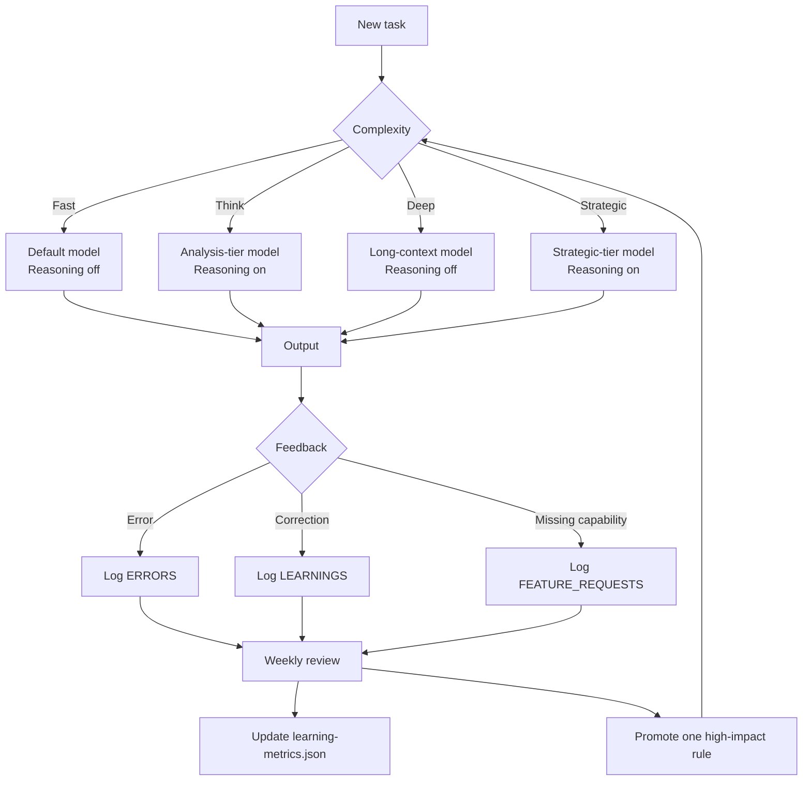

# Adaptive Routing and Learning

Purpose
- Route tasks to the right model depth
- Improve quality weekly through measured feedback

## Routing Matrix

| Route | Use When | Preferred Model | Reasoning |
|------|----------|-----------------|-----------|
| Fast | direct answer and routine operation | default model | off |
| Think | analysis and structured planning | analysis-tier model | on |
| Deep | long-context synthesis and publication-grade output | long-context model | off |
| Strategic | architecture and high-impact tradeoff decisions | strategic-tier model | on |

## Escalation Signals
- quality is shallow
- source conflict or high uncertainty
- multi-step tradeoff reasoning is required
- first draft is not publish-ready

## Weekly Metrics Source
`memory/learning-metrics.json`

## Visual Flow

