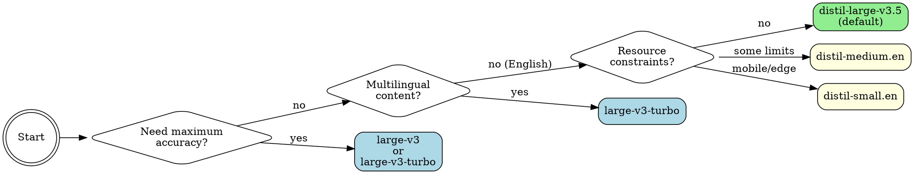

# Faster Whisper

Local speech-to-text using faster-whisper — a CTranslate2 reimplementation of OpenAI's Whisper that runs **4-6x faster** with identical accuracy. With GPU acceleration, expect **~20x realtime** transcription (a 10-minute audio file in ~30 seconds).

## When to Use

Use this skill when you need to:

- **Transcribe audio/video files** — meetings, interviews, podcasts, lectures, YouTube videos
- **Generate subtitles** — SRT, VTT, ASS, LRC, or TTML broadcast-standard subtitles
- **Identify speakers** — diarization labels who said what (`--diarize`)
- **Transcribe from URLs** — YouTube links and direct audio URLs (auto-downloads via yt-dlp)
- **Transcribe podcast feeds** — `--rss <feed-url>` fetches and transcribes episodes
- **Batch process files** — glob patterns, directories, skip-existing support; ETA shown automatically
- **Convert speech to text locally** — no API costs, works offline (after model download)
- **Translate to English** — translate any language to English with `--translate`
- **Do multilingual transcription** — supports 99+ languages with auto-detection
- **Transcribe a batch of files in different languages** — `--language-map` assigns a different language per file
- **Transcribe multilingual audio** — `--multilingual` for mixed-language audio
- **Transcribe audio with specific terms** — use `--initial-prompt` for jargon-heavy content or any other terms to look out for
- **Preprocess noisy audio (before transcription)** — `--normalize` and `--denoise` before transcription
- **Stream output** — `--stream` shows segments as they're transcribed
- **Clip time ranges** — `--clip-timestamps` to transcribe specific sections
- **Search the transcript** — `--search "term"` finds all timestamps where a word/phrase appears
- **Detect chapters** — `--detect-chapters` finds section breaks from silence gaps
- **Export speaker audio** — `--export-speakers DIR` saves each speaker's turns as separate WAV files
- **Spreadsheet output** — `--format csv` produces a properly-quoted CSV with timestamps

**Trigger phrases:**
"transcribe this audio", "convert speech to text", "what did they say", "make a transcript",
"audio to text", "subtitle this video", "who's speaking", "translate this audio", "translate to English",
"find where X is mentioned", "search transcript for", "when did they say", "at what timestamp",
"add chapters", "detect chapters", "find breaks in the audio", "table of contents for this recording",
"TTML subtitles", "DFXP subtitles", "broadcast format subtitles", "Netflix format",
"ASS subtitles", "aegisub format", "advanced substation alpha", "mpv subtitles",
"LRC subtitles", "timed lyrics", "karaoke subtitles", "music player lyrics",
"HTML transcript", "confidence-colored transcript", "color-coded transcript",
"separate audio per speaker", "export speaker audio", "split by speaker",
"transcript as CSV", "spreadsheet output", "transcribe podcast", "podcast RSS feed",
"different languages in batch", "per-file language",
"transcribe in multiple formats", "srt and txt at the same time", "output both srt and text",
"remove filler words", "clean up ums and uhs", "strip hesitation sounds", "remove you know and I mean",
"transcribe left channel", "transcribe right channel", "stereo channel", "left track only",
"wrap subtitle lines", "character limit per line", "max chars per subtitle",
"detect paragraphs", "paragraph breaks", "group into paragraphs", "add paragraph spacing"

**⚠️ Agent guidance — keep invocations minimal:**

_CORE RULE: default command (`./scripts/transcribe audio.mp3`) is the fastest path — add flags only when the user explicitly asks for that capability._

**Transcription:**

- Only add `--diarize` if the user asks "who said what" / "identify speakers" / "label speakers"
- Only add `--format srt/vtt/ass/lrc/ttml` if the user asks for subtitles/captions in that format
- Only add `--format csv` if the user asks for CSV or spreadsheet output
- Only add `--word-timestamps` if the user needs word-level timing
- Only add `--initial-prompt` if there's domain-specific jargon to prime
- Only add `--translate` if the user wants non-English audio translated to English
- Only add `--normalize`/`--denoise` if the user mentions bad audio quality or noise
- Only add `--stream` if the user wants live/progressive output for long files
- Only add `--clip-timestamps` if the user wants a specific time range
- Only add `--temperature 0.0` if the model is hallucinating on music/silence
- Only add `--vad-threshold` if VAD is aggressively cutting speech or including noise
- Only add `--min-speakers`/`--max-speakers` when you know the speaker count
- Only add `--hf-token` if the token is not cached at `~/.cache/huggingface/token`
- Only add `--max-words-per-line` for subtitle readability on long segments
- Only add `--filter-hallucinations` if the transcript contains obvious artifacts (music markers, duplicates)
- Only add `--merge-sentences` if the user asks for sentence-level subtitle cues
- Only add `--clean-filler` if the user asks to remove filler words (um, uh, you know, I mean, hesitation sounds)
- Only add `--channel left|right` if the user mentions stereo tracks, dual-channel recordings, or asks for a specific channel
- Only add `--max-chars-per-line N` when the user specifies a character limit per subtitle line (e.g., "Netflix format", "42 chars per line"); takes priority over `--max-words-per-line`
- Only add `--detect-paragraphs` if the user asks for paragraph breaks or structured text output; `--paragraph-gap` (default 3.0s) only if they want a custom gap
- Only add `--speaker-names "Alice,Bob"` when the user provides real names to replace SPEAKER_1/2 — always requires `--diarize`
- Only add `--hotwords WORDS` when the user names specific rare terms not well served by `--initial-prompt`; prefer `--initial-prompt` for general domain jargon
- Only add `--prefix TEXT` when the user knows the exact words the audio starts with
- Only add `--detect-language-only` when the user only wants to identify the language, not transcribe
- Only add `--stats-file PATH` if the user asks for performance stats, RTF, or benchmark info
- Only add `--parallel N` for large CPU batch jobs; GPU handles one file efficiently on its own — don't add for single files or small batches
- Only add `--retries N` for unreliable inputs (URLs, network files) where transient failures are expected
- Only add `--burn-in OUTPUT` only when user explicitly asks to embed/burn subtitles into the video; requires ffmpeg and a video file input
- Only add `--keep-temp` when the user may re-process the same URL to avoid re-downloading
- Only add `--output-template` when user specifies a custom naming pattern in batch mode
- **Multi-format output** (`--format srt,text`): only when user explicitly wants multiple formats in one pass; always pair with `-o <dir>`
- Any word-level feature auto-runs wav2vec2 alignment (~5-10s overhead)
- `--diarize` adds ~20-30s on top of that

**Search:**

- Only add `--search "term"` when the user asks to find/locate/search for a specific word or phrase in audio
- `--search` **replaces** the normal transcript output — it prints only matching segments with timestamps
- Add `--search-fuzzy` only when the user mentions approximate/partial matching or typos
- To save search results to a file, use `-o results.txt`

**Chapter detection:**

- Only add `--detect-chapters` when the user asks for chapters, sections, a table of contents, or "where does the topic change"
- Default `--chapter-gap 8` (8-second silence = new chapter) works for most podcasts/lectures; tune down for dense content
- `--chapter-format youtube` (default) outputs YouTube-ready timestamps; use `json` for programmatic use
- **Always use `--chapters-file PATH`** when combining chapters with a transcript output — avoids mixing chapter markers into the transcript text
- If the user only wants chapters (not the transcript), pipe stdout to a file with `-o /dev/null` and use `--chapters-file`
- **Batch mode limitation:** `--chapters-file` takes a single path — in batch mode, each file's chapters overwrite the previous. For batch chapter detection, omit `--chapters-file` (chapters print to stdout under `=== CHAPTERS (N) ===`) or use a separate run per file

**Speaker audio export:**

- Only add `--export-speakers DIR` when the user explicitly asks to save each speaker's audio separately
- Always pair with `--diarize` — it silently skips if no speaker labels are present
- Requires ffmpeg; outputs `SPEAKER_1.wav`, `SPEAKER_2.wav`, etc. (or real names if `--speaker-names` is set)

**Language map:**

- Only add `--language-map` in batch mode when the user has confirmed different languages across files
- Inline format: `"interview*.mp3=en,lecture*.mp3=fr"` — fnmatch globs on filename
- JSON file format: `@/path/to/map.json` where the file is `{"pattern": "lang_code"}`

**RSS / Podcast:**

- Only add `--rss URL` when the user provides a podcast RSS feed URL
- Default fetches 5 newest episodes; `--rss-latest 0` for all; `--skip-existing` to resume safely
- **Always use `-o <dir>`** with `--rss` — without it, all episode transcripts print to stdout concatenated, which is hard to use; each episode gets its own file when `-o <dir>` is set

**Output format for agent relay:**

- **Search results** (`--search`) → print directly to user; output is human-readable
- **Chapter output** → if no `--chapters-file`, chapters appear in stdout under `=== CHAPTERS (N) ===` header after the transcript; with `--format json`, chapters are also embedded in the JSON under `"chapters"` key
- **Subtitle formats** (SRT, VTT, ASS, LRC, TTML) → always write to `-o` file; tell the user the output path, never paste raw subtitle content
- **Data formats** (CSV, HTML, TTML, JSON) → always write to `-o` file; tell the user the output path, don't paste raw XML/CSV/HTML
- **ASS format** → for Aegisub, VLC, mpv; write to file and tell user they can open it in Aegisub or play it in VLC/mpv
- **LRC format** → timed lyrics for music players (Foobar2000, AIMP, VLC); write to file
- **Multi-format** (`--format srt,text`) → requires `-o <dir>`; each format goes to a separate file; tell user all paths written
- **JSON format** → useful for programmatic post-processing; not ideal to paste in full to user
- **Text/transcript** → safe to show directly to user for short files; summarise for long ones
- **Stats output** (`--stats-file`) → summarise key fields (duration, processing time, RTF) for the user rather than pasting raw JSON
- **Language detection** (`--detect-language-only`) → print the result directly; it's a single line
- **ETA** is printed automatically to stderr for batch jobs; no action needed

**When NOT to use:**

- Cloud-only environments without local compute
- Files <10 seconds where API call latency doesn't matter

**faster-whisper vs whisperx:**
This skill covers everything whisperx does — diarization (`--diarize`), word-level timestamps (`--word-timestamps`), SRT/VTT subtitles — so whisperx is not needed. Use whisperx only if you specifically need its pyannote pipeline or batch-GPU features not covered here.

## Quick Reference

| Task                           | Command                                                                                | Notes                                               |
| ------------------------------ | -------------------------------------------------------------------------------------- | --------------------------------------------------- |
| **Basic transcription**        | `./scripts/transcribe audio.mp3`                                                       | Batched inference, VAD on, distil-large-v3.5        |
| **SRT subtitles**              | `./scripts/transcribe audio.mp3 --format srt -o subs.srt`                              | Word timestamps auto-enabled                        |
| **VTT subtitles**              | `./scripts/transcribe audio.mp3 --format vtt -o subs.vtt`                              | WebVTT format                                       |
| **Word timestamps**            | `./scripts/transcribe audio.mp3 --word-timestamps --format srt`                        | wav2vec2 aligned (~10ms)                            |
| **Speaker diarization**        | `./scripts/transcribe audio.mp3 --diarize`                                             | Requires pyannote.audio                             |
| **Translate → English**        | `./scripts/transcribe audio.mp3 --translate`                                           | Any language → English                              |
| **Stream output**              | `./scripts/transcribe audio.mp3 --stream`                                              | Live segments as transcribed                        |
| **Clip time range**            | `./scripts/transcribe audio.mp3 --clip-timestamps "30,60"`                             | Only 30s–60s                                        |
| **Denoise + normalize**        | `./scripts/transcribe audio.mp3 --denoise --normalize`                                 | Clean up noisy audio first                          |
| **Reduce hallucination**       | `./scripts/transcribe audio.mp3 --hallucination-silence-threshold 1.0`                 | Skip hallucinated silence                           |
| **YouTube/URL**                | `./scripts/transcribe https://youtube.com/watch?v=...`                                 | Auto-downloads via yt-dlp                           |
| **Batch process**              | `./scripts/transcribe *.mp3 -o ./transcripts/`                                         | Output to directory                                 |
| **Batch with skip**            | `./scripts/transcribe *.mp3 --skip-existing -o ./out/`                                 | Resume interrupted batches                          |
| **Domain terms**               | `./scripts/transcribe audio.mp3 --initial-prompt 'Kubernetes gRPC'`                    | Boost rare terminology                              |
| **Hotwords boost**             | `./scripts/transcribe audio.mp3 --hotwords 'JIRA Kubernetes'`                          | Bias decoder toward specific words                  |
| **Prefix conditioning**        | `./scripts/transcribe audio.mp3 --prefix 'Good morning,'`                              | Seed the first segment with known opening words     |
| **Pin model version**          | `./scripts/transcribe audio.mp3 --revision v1.2.0`                                     | Reproducible transcription with a pinned revision   |
| **Debug library logs**         | `./scripts/transcribe audio.mp3 --log-level debug`                                     | Show faster_whisper internal logs                   |
| **Turbo model**                | `./scripts/transcribe audio.mp3 -m turbo`                                              | Alias for large-v3-turbo                            |
| **Faster English**             | `./scripts/transcribe audio.mp3 --model distil-medium.en -l en`                        | English-only, 6.8x faster                           |
| **Maximum accuracy**           | `./scripts/transcribe audio.mp3 --model large-v3 --beam-size 10`                       | Full model                                          |
| **JSON output**                | `./scripts/transcribe audio.mp3 --format json -o out.json`                             | Programmatic access with stats                      |
| **Filter noise**               | `./scripts/transcribe audio.mp3 --min-confidence 0.6`                                  | Drop low-confidence segments                        |
| **Hybrid quantization**        | `./scripts/transcribe audio.mp3 --compute-type int8_float16`                           | Save VRAM, minimal quality loss                     |
| **Reduce batch size**          | `./scripts/transcribe audio.mp3 --batch-size 4`                                        | If OOM on GPU                                       |
| **TSV output**                 | `./scripts/transcribe audio.mp3 --format tsv -o out.tsv`                               | OpenAI Whisper–compatible TSV                       |
| **Fix hallucinations**         | `./scripts/transcribe audio.mp3 --temperature 0.0 --no-speech-threshold 0.8`           | Lock temperature + skip silence                     |
| **Tune VAD sensitivity**       | `./scripts/transcribe audio.mp3 --vad-threshold 0.6 --min-silence-duration 500`        | Tighter speech detection                            |
| **Known speaker count**        | `./scripts/transcribe meeting.wav --diarize --min-speakers 2 --max-speakers 3`         | Constrain diarization                               |
| **Subtitle word wrapping**     | `./scripts/transcribe audio.mp3 --format srt --word-timestamps --max-words-per-line 8` | Split long cues                                     |
| **Private/gated model**        | `./scripts/transcribe audio.mp3 --hf-token hf_xxx`                                     | Pass token directly                                 |
| **Show version**               | `./scripts/transcribe --version`                                                       | Print faster-whisper version                        |
| **Upgrade in-place**           | `./setup.sh --update`                                                                  | Upgrade without full reinstall                      |
| **System check**               | `./setup.sh --check`                                                                   | Verify GPU, Python, ffmpeg, venv, yt-dlp, pyannote  |
| **Detect language only**       | `./scripts/transcribe audio.mp3 --detect-language-only`                                | Fast language ID, no transcription                  |
| **Detect language JSON**       | `./scripts/transcribe audio.mp3 --detect-language-only --format json`                  | Machine-readable language detection                 |
| **LRC subtitles**              | `./scripts/transcribe audio.mp3 --format lrc -o lyrics.lrc`                            | Timed lyrics format for music players               |
| **ASS subtitles**              | `./scripts/transcribe audio.mp3 --format ass -o subtitles.ass`                         | Advanced SubStation Alpha (Aegisub, mpv, VLC)       |
| **Merge sentences**            | `./scripts/transcribe audio.mp3 --format srt --merge-sentences`                        | Join fragments into sentence chunks                 |
| **Stats sidecar**              | `./scripts/transcribe audio.mp3 --stats-file stats.json`                               | Write perf stats JSON after transcription           |
| **Batch stats**                | `./scripts/transcribe *.mp3 --stats-file ./stats/`                                     | One stats file per input in dir                     |
| **Template naming**            | `./scripts/transcribe audio.mp3 -o ./out/ --output-template "{stem}_{lang}.{ext}"`     | Custom batch output filenames                       |
| **Stdin input**                | `ffmpeg -i input.mp4 -f wav - \| ./scripts/transcribe -`                               | Pipe audio directly from stdin                      |
| **Custom model dir**           | `./scripts/transcribe audio.mp3 --model-dir ~/my-models`                               | Custom HuggingFace cache dir                        |
| **Local model**                | `./scripts/transcribe audio.mp3 -m ./my-model-ct2`                                     | CTranslate2 model dir                               |
| **HTML transcript**            | `./scripts/transcribe audio.mp3 --format html -o out.html`                             | Confidence-colored                                  |
| **Burn subtitles**             | `./scripts/transcribe video.mp4 --burn-in output.mp4`                                  | Requires ffmpeg + video input                       |
| **Name speakers**              | `./scripts/transcribe audio.mp3 --diarize --speaker-names "Alice,Bob"`                 | Replaces SPEAKER_1/2                                |
| **Filter hallucinations**      | `./scripts/transcribe audio.mp3 --filter-hallucinations`                               | Removes artifacts                                   |
| **Keep temp files**            | `./scripts/transcribe https://... --keep-temp`                                         | For URL re-processing                               |
| **Parallel batch**             | `./scripts/transcribe *.mp3 --parallel 4 -o ./out/`                                    | CPU multi-file                                      |
| **RTX 3070 recommended**       | `./scripts/transcribe audio.mp3 --compute-type int8_float16`                           | Saves ~1GB VRAM, minimal quality loss               |
| **CPU thread count**           | `./scripts/transcribe audio.mp3 --threads 8`                                           | Force CPU thread count (default: auto)              |
| **Podcast RSS (latest 5)**     | `./scripts/transcribe --rss https://feeds.example.com/podcast.xml`                     | Downloads & transcribes newest 5 episodes           |
| **Podcast RSS (all episodes)** | `./scripts/transcribe --rss https://... --rss-latest 0 -o ./episodes/`                 | All episodes, one file each                         |
| **Podcast + SRT subtitles**    | `./scripts/transcribe --rss https://... --format srt -o ./subs/`                       | Subtitle all episodes                               |
| **Retry on failure**           | `./scripts/transcribe *.mp3 --retries 3 -o ./out/`                                     | Retry up to 3× with backoff on error                |
| **CSV output**                 | `./scripts/transcribe audio.mp3 --format csv -o out.csv`                               | Spreadsheet-ready with header row; properly quoted  |
| **CSV with speakers**          | `./scripts/transcribe audio.mp3 --diarize --format csv -o out.csv`                     | Adds speaker column                                 |
| **Language map (inline)**      | `./scripts/transcribe *.mp3 --language-map "interview*.mp3=en,lecture.wav=fr"`         | Per-file language in batch                          |
| **Language map (JSON)**        | `./scripts/transcribe *.mp3 --language-map @langs.json`                                | JSON file: {"pattern": "lang"}                      |
| **Batch with ETA**             | `./scripts/transcribe *.mp3 -o ./out/`                                                 | Automatic ETA shown for each file in batch          |
| **TTML subtitles**             | `./scripts/transcribe audio.mp3 --format ttml -o subtitles.ttml`                       | Broadcast-standard DFXP/TTML (Netflix, BBC, Amazon) |
| **TTML with speaker labels**   | `./scripts/transcribe audio.mp3 --diarize --format ttml -o subtitles.ttml`             | Speaker-labeled TTML                                |
| **Search transcript**          | `./scripts/transcribe audio.mp3 --search "keyword"`                                    | Find timestamps where keyword appears               |
| **Search to file**             | `./scripts/transcribe audio.mp3 --search "keyword" -o results.txt`                     | Save search results                                 |
| **Fuzzy search**               | `./scripts/transcribe audio.mp3 --search "aproximate" --search-fuzzy`                  | Approximate/partial matching                        |
| **Detect chapters**            | `./scripts/transcribe audio.mp3 --detect-chapters`                                     | Auto-detect chapters from silence gaps              |
| **Chapter gap tuning**         | `./scripts/transcribe audio.mp3 --detect-chapters --chapter-gap 5`                     | Chapters on gaps ≥5s (default: 8s)                  |
| **Chapters to file**           | `./scripts/transcribe audio.mp3 --detect-chapters --chapters-file ch.txt`              | Save YouTube-format chapter list                    |
| **Chapters JSON**              | `./scripts/transcribe audio.mp3 --detect-chapters --chapter-format json`               | Machine-readable chapter list                       |
| **Export speaker audio**       | `./scripts/transcribe audio.mp3 --diarize --export-speakers ./speakers/`               | Save each speaker's audio to separate WAV files     |
| **Multi-format output**        | `./scripts/transcribe audio.mp3 --format srt,text -o ./out/`                           | Write SRT + TXT in one pass                         |
| **Remove filler words**        | `./scripts/transcribe audio.mp3 --clean-filler`                                        | Strip um/uh/er/ah/hmm and discourse markers         |
| **Left channel only**          | `./scripts/transcribe audio.mp3 --channel left`                                        | Extract left stereo channel before transcribing     |
| **Right channel only**         | `./scripts/transcribe audio.mp3 --channel right`                                       | Extract right stereo channel                        |
| **Max chars per line**         | `./scripts/transcribe audio.mp3 --format srt --max-chars-per-line 42`                  | Character-based subtitle wrapping                   |
| **Detect paragraphs**          | `./scripts/transcribe audio.mp3 --detect-paragraphs`                                   | Insert paragraph breaks in text output              |
| **Paragraph gap tuning**       | `./scripts/transcribe audio.mp3 --detect-paragraphs --paragraph-gap 5.0`               | Tune gap threshold (default 3.0s)                   |

## Model Selection

Choose the right model for your needs:



### Model Table

#### Standard Models (Full Whisper)

| Model                  | Size  | Speed     | Accuracy  | Use Case                           |
| ---------------------- | ----- | --------- | --------- | ---------------------------------- |
| `tiny` / `tiny.en`     | 39M   | Fastest   | Basic     | Quick drafts                       |
| `base` / `base.en`     | 74M   | Very fast | Good      | General use                        |
| `small` / `small.en`   | 244M  | Fast      | Better    | Most tasks                         |
| `medium` / `medium.en` | 769M  | Moderate  | High      | Quality transcription              |
| `large-v1/v2/v3`       | 1.5GB | Slower    | Best      | Maximum accuracy                   |
| `large-v3-turbo`       | 809M  | Fast      | Excellent | High accuracy (slower than distil) |

#### Distilled Models (~6x Faster, ~1% WER difference)

| Model                   | Size | Speed vs Standard | Accuracy  | Use Case                           |
| ----------------------- | ---- | ----------------- | --------- | ---------------------------------- |
| **`distil-large-v3.5`** | 756M | ~6.3x faster      | 7.08% WER | **Default, best balance**          |
| `distil-large-v3`       | 756M | ~6.3x faster      | 7.53% WER | Previous default                   |
| `distil-large-v2`       | 756M | ~5.8x faster      | 10.1% WER | Fallback                           |
| `distil-medium.en`      | 394M | ~6.8x faster      | 11.1% WER | English-only, resource-constrained |
| `distil-small.en`       | 166M | ~5.6x faster      | 12.1% WER | Mobile/edge devices                |

`.en` models are English-only and slightly faster/better for English content.

> **Note for distil models:** HuggingFace recommends disabling `condition_on_previous_text` for all distil models to prevent repetition loops. The script **auto-applies** `--no-condition-on-previous-text` whenever a `distil-*` model is detected. Pass `--condition-on-previous-text` to override if needed.

## Custom & Fine-tuned Models

WhisperModel accepts local CTranslate2 model directories and HuggingFace repo names — no code changes needed.

### Load a local CTranslate2 model

```bash
./scripts/transcribe audio.mp3 --model /path/to/my-model-ct2
```

### Convert a HuggingFace model to CTranslate2

```bash
pip install ctranslate2
ct2-transformers-converter \
  --model openai/whisper-large-v3 \
  --output_dir whisper-large-v3-ct2 \
  --copy_files tokenizer.json preprocessor_config.json \
  --quantization float16
./scripts/transcribe audio.mp3 --model ./whisper-large-v3-ct2
```

### Load a model by HuggingFace repo name (auto-downloads)

```bash
./scripts/transcribe audio.mp3 --model username/whisper-large-v3-ct2
```

### Custom model cache directory

By default, models are cached in `~/.cache/huggingface/`. Use `--model-dir` to override:

```bash
./scripts/transcribe audio.mp3 --model-dir ~/my-models
```

## Setup

### Linux / macOS / WSL2

```bash
# Base install (creates venv, installs deps, auto-detects GPU)
./setup.sh

# With speaker diarization support
./setup.sh --diarize
```

Requirements:

- Python 3.10+
- ffmpeg is **not required** for basic transcription — PyAV (bundled with faster-whisper) handles audio decoding. ffmpeg is only needed for `--burn-in`, `--normalize`, and `--denoise`.
- Optional: yt-dlp (for URL/YouTube input)
- Optional: pyannote.audio (for `--diarize`, installed via `setup.sh --diarize`)

### Platform Support

| Platform               | Acceleration | Speed            |
| ---------------------- | ------------ | ---------------- |
| **Linux + NVIDIA GPU** | CUDA         | ~20x realtime 🚀 |
| **WSL2 + NVIDIA GPU**  | CUDA         | ~20x realtime 🚀 |
| macOS Apple Silicon    | CPU\*        | ~3-5x realtime   |
| macOS Intel            | CPU          | ~1-2x realtime   |
| Linux (no GPU)         | CPU          | ~1x realtime     |

\*faster-whisper uses CTranslate2 which is CPU-only on macOS, but Apple Silicon is fast enough for practical use.

### GPU Support (IMPORTANT!)

The setup script auto-detects your GPU and installs PyTorch with CUDA. **Always use GPU if available** — CPU transcription is extremely slow.

| Hardware       | Speed          | 9-min video |
| -------------- | -------------- | ----------- |
| RTX 3070 (GPU) | ~20x realtime  | ~27 sec     |
| CPU (int8)     | ~0.3x realtime | ~30 min     |

> **RTX 3070 tip**: Use `--compute-type int8_float16` for hybrid quantization — saves ~1GB VRAM with minimal quality loss. Ideal for running diarization alongside transcription.

If setup didn't detect your GPU, manually install PyTorch with CUDA:

```bash
# For CUDA 12.x
uv pip install --python .venv/bin/python torch --index-url https://download.pytorch.org/whl/cu121

# For CUDA 11.x
uv pip install --python .venv/bin/python torch --index-url https://download.pytorch.org/whl/cu118
```

- **WSL2 users**: Ensure you have the [NVIDIA CUDA drivers for WSL](https://docs.nvidia.com/cuda/wsl-user-guide/) installed on Windows

## Usage

```bash
# Basic transcription
./scripts/transcribe audio.mp3

# SRT subtitles
./scripts/transcribe audio.mp3 --format srt -o subtitles.srt

# WebVTT subtitles
./scripts/transcribe audio.mp3 --format vtt -o subtitles.vtt

# Transcribe from YouTube URL
./scripts/transcribe https://youtube.com/watch?v=dQw4w9WgXcQ --language en

# Speaker diarization
./scripts/transcribe meeting.wav --diarize

# Diarized VTT subtitles
./scripts/transcribe meeting.wav --diarize --format vtt -o meeting.vtt

# Prime with domain terminology
./scripts/transcribe lecture.mp3 --initial-prompt "Kubernetes, gRPC, PostgreSQL, NGINX"

# Batch process a directory
./scripts/transcribe ./recordings/ -o ./transcripts/

# Batch with glob, skip already-done files
./scripts/transcribe *.mp3 --skip-existing -o ./transcripts/

# Filter low-confidence segments
./scripts/transcribe noisy-audio.mp3 --min-confidence 0.6

# JSON output with full metadata
./scripts/transcribe audio.mp3 --format json -o result.json

# Specify language (faster than auto-detect)
./scripts/transcribe audio.mp3 --language en
```

## Options

```
Input:
  AUDIO                 Audio file(s), directory, glob pattern, or URL
                        Accepts: mp3, wav, m4a, flac, ogg, webm, mp4, mkv, avi, wma, aac
                        URLs auto-download via yt-dlp (YouTube, direct links, etc.)

Model & Language:
  -m, --model NAME      Whisper model (default: distil-large-v3.5; "turbo" = large-v3-turbo)
  --revision REV        Model revision (git branch/tag/commit) to pin a specific version
  -l, --language CODE   Language code, e.g. en, es, fr (auto-detects if omitted)
  --initial-prompt TEXT  Prompt to condition the model (terminology, formatting style)
  --prefix TEXT         Prefix to condition the first segment (e.g. known starting words)
  --hotwords WORDS      Space-separated hotwords to boost recognition
  --translate           Translate any language to English (instead of transcribing)
  --multilingual        Enable multilingual/code-switching mode (helps smaller models)
  --hf-token TOKEN      HuggingFace token for private/gated models and diarization
  --model-dir PATH      Custom model cache directory (default: ~/.cache/huggingface/)

Output Format:
  -f, --format FMT      text | json | srt | vtt | tsv | lrc | html | ass | ttml (default: text)
                        Accepts comma-separated list: --format srt,text writes both in one pass
                        Multi-format requires -o <dir> when saving to files
  --word-timestamps     Include word-level timestamps (wav2vec2 aligned automatically)
  --stream              Output segments as they are transcribed (disables diarize/alignment)
  --max-words-per-line N  For SRT/VTT, split segments into sub-cues of at most N words
  --max-chars-per-line N  For SRT/VTT/ASS/TTML, split lines so each fits within N characters
                        Takes priority over --max-words-per-line when both are set
  --clean-filler        Remove hesitation fillers (um, uh, er, ah, hmm, hm) and discourse markers
                        (you know, I mean, you see) from transcript text. Off by default.
  --detect-paragraphs   Insert paragraph breaks (blank lines) in text output at natural boundaries.
                        A new paragraph starts when: silence gap ≥ --paragraph-gap, OR the previous
                        segment ends a sentence AND the gap ≥ 1.5s.
  --paragraph-gap SEC   Minimum silence gap in seconds to start a new paragraph (default: 3.0).
                        Used with --detect-paragraphs.
  --channel {left,right,mix}
                        Stereo channel to transcribe: left (c0), right (c1), or mix (default: mix).
                        Extracts the channel via ffmpeg before transcription. Requires ffmpeg.
  --merge-sentences     Merge consecutive segments into sentence-level chunks
                        (improves SRT/VTT readability; groups by terminal punctuation or >2s gap)
  -o, --output PATH     Output file or directory (directory for batch mode)
  --output-template TEMPLATE
                        Batch output filename template. Variables: {stem}, {lang}, {ext}, {model}
                        Example: "{stem}_{lang}.{ext}" → "interview_en.srt"

Inference Tuning:
  --beam-size N         Beam search size; higher = more accurate but slower (default: 5)
  --temperature T       Sampling temperature or comma-separated fallback list, e.g.
                        '0.0' or '0.0,0.2,0.4' (default: faster-whisper's schedule)
  --no-speech-threshold PROB
                        Probability threshold to mark segments as silence (default: 0.6)
  --batch-size N        Batched inference batch size (default: 8; reduce if OOM)
  --no-vad              Disable voice activity detection (on by default)
  --vad-threshold T     VAD speech probability threshold (default: 0.5)
  --vad-neg-threshold T VAD negative threshold for ending speech (default: auto)
  --vad-onset T         Alias for --vad-threshold (legacy)
  --vad-offset T        Alias for --vad-neg-threshold (legacy)
  --min-speech-duration MS  Minimum speech segment duration in ms (default: 0)
  --max-speech-duration SEC Maximum speech segment duration in seconds (default: unlimited)
  --min-silence-duration MS Minimum silence before splitting a segment in ms (default: 2000)
  --speech-pad MS       Padding around speech segments in ms (default: 400)
  --no-batch            Disable batched inference (use standard WhisperModel)
  --hallucination-silence-threshold SEC
                        Skip silent sections where model hallucinates (e.g. 1.0)
  --no-condition-on-previous-text
                        Don't condition on previous text (reduces repetition/hallucination loops;
                        auto-enabled for distil models per HuggingFace recommendation)
  --condition-on-previous-text
                        Force-enable conditioning on previous text (overrides auto-disable for distil models)
  --compression-ratio-threshold RATIO
                        Filter segments above this compression ratio (default: 2.4)
  --log-prob-threshold PROB
                        Filter segments below this avg log probability (default: -1.0)
  --max-new-tokens N    Maximum tokens per segment (prevents runaway generation)
  --clip-timestamps RANGE
                        Transcribe specific time ranges: '30,60' or '0,30;60,90' (seconds)
  --progress            Show transcription progress bar
  --best-of N           Candidates when sampling with non-zero temperature (default: 5)
  --patience F          Beam search patience factor (default: 1.0)
  --repetition-penalty F  Penalty for repeated tokens (default: 1.0)
  --no-repeat-ngram-size N  Prevent n-gram repetitions of this size (default: 0 = off)

Advanced Inference:
  --no-timestamps       Output text without timing info (faster; incompatible with
                        --word-timestamps, --format srt/vtt/tsv, --diarize)
  --chunk-length N      Audio chunk length in seconds for batched inference (default: auto)
  --language-detection-threshold T
                        Confidence threshold for language auto-detection (default: 0.5)
  --language-detection-segments N
                        Audio segments to sample for language detection (default: 1)
  --length-penalty F    Beam search length penalty; >1 favors longer, <1 favors shorter (default: 1.0)
  --prompt-reset-on-temperature T
                        Reset initial prompt when temperature fallback hits threshold (default: 0.5)
  --no-suppress-blank   Disable blank token suppression (may help soft/quiet speech)
  --suppress-tokens IDS Comma-separated token IDs to suppress in addition to default -1
  --max-initial-timestamp T
                        Maximum timestamp for the first segment in seconds (default: 1.0)
  --prepend-punctuations CHARS
                        Punctuation characters merged into preceding word (default: "'¿([{-)
  --append-punctuations CHARS
                        Punctuation characters merged into following word (default: "'.。,，!！?？:：")]}、")

Preprocessing:
  --normalize           Normalize audio volume (EBU R128 loudnorm) before transcription
  --denoise             Apply noise reduction (high-pass + FFT denoise) before transcription

Advanced:
  --diarize             Speaker diarization (requires pyannote.audio)
  --min-speakers N      Minimum number of speakers hint for diarization
  --max-speakers N      Maximum number of speakers hint for diarization
  --speaker-names NAMES Comma-separated names to replace SPEAKER_1, SPEAKER_2 (e.g. 'Alice,Bob')
                        Requires --diarize
  --min-confidence PROB Filter segments below this avg word confidence (0.0–1.0)
  --skip-existing       Skip files whose output already exists (batch mode)
  --detect-language-only
                        Detect language and exit (no transcription). Output: "Language: en (probability: 0.984)"
                        With --format json: {"language": "en", "language_probability": 0.984}
  --stats-file PATH     Write JSON stats sidecar after transcription (processing time, RTF, word count, etc.)
                        Directory path → writes {stem}.stats.json inside; file path → exact path
  --burn-in OUTPUT      Burn subtitles into the original video (single-file mode only; requires ffmpeg)
  --filter-hallucinations
                        Filter common Whisper hallucinations: music/applause markers, duplicate segments,
                        'Thank you for watching', lone punctuation, etc.
  --keep-temp           Keep temp files from URL downloads (useful for re-processing without re-downloading)
  --parallel N          Number of parallel workers for batch processing (default: sequential)
  --retries N           Retry failed files up to N times with exponential backoff (default: 0;
                        incompatible with --parallel)

Batch ETA:
  Automatically shown for sequential batch jobs (no flag needed). After each file completes,
  the next file's progress line includes:  [current/total] filename | ETA: Xm Ys
  ETA is calculated from average time per file × remaining files.
  Shown to stderr (surfaced to users via OpenClaw/Clawdbot output).

Language Map (per-file language override):
  --language-map MAP    Per-file language override for batch mode. Two forms:
                          Inline: "interview*.mp3=en,lecture.wav=fr,keynote.wav=de"
                          JSON file: "@/path/to/map.json"  (must be {pattern: lang} dict)
                        Patterns support fnmatch globs on filename or stem.
                        Priority: exact filename > exact stem > glob on filename > glob on stem > fallback.
                        Files not matched fall back to --language (or auto-detect if not set).

Transcript Search:
  --search TERM         Search the transcript for TERM and print matching segments with timestamps.
                        Replaces normal transcript output (use -o to save results to a file).
                        Case-insensitive exact substring match by default.
  --search-fuzzy        Enable fuzzy/approximate matching with --search (useful for typos, phonetic
                        near-misses, or partial words; uses SequenceMatcher ratio ≥ 0.6)

Chapter Detection:
  --detect-chapters     Auto-detect chapter/section breaks from silence gaps and print chapter markers.
                        Output is printed after the transcript (or to --chapters-file).
  --chapter-gap SEC     Minimum silence gap in seconds between consecutive segments to start a new
                        chapter (default: 8.0). Tune down for dense speech, up for sparse content.
  --chapters-file PATH  Write chapter markers to this file (default: stdout after transcript)
  --chapter-format FMT  youtube | text | json — chapter output format:
                          youtube: "0:00 Chapter 1" (YouTube description ready)
                          text:    "Chapter 1: 00:00:00"
                          json:    JSON array with chapter, start, title fields
                        (default: youtube)

Speaker Audio Export:
  --export-speakers DIR After diarization, export each speaker's audio turns concatenated into
                        separate WAV files saved in DIR. Requires --diarize and ffmpeg.
                        Output: SPEAKER_1.wav, SPEAKER_2.wav, … (or real names if --speaker-names set)

RSS / Podcast:
  --rss URL             Podcast RSS feed URL — extracts audio enclosures and transcribes them.
                        AUDIO positional is optional when --rss is used.
  --rss-latest N        Number of most-recent episodes to process (default: 5; 0 = all episodes)

Device:
  --device DEV          auto | cpu | cuda (default: auto)
  --compute-type TYPE   auto | int8 | int8_float16 | float16 | float32 (default: auto)
                        int8_float16 = hybrid mode for GPU (saves VRAM, minimal quality loss)
  --threads N           CPU thread count for CTranslate2 (default: auto)
  -q, --quiet           Suppress progress and status messages
  --log-level LEVEL     Set faster_whisper library logging level: debug | info | warning | error
                        (default: warning; use debug to see CTranslate2/VAD internals)

Utility:
  --version             Print installed faster-whisper version and exit
  --update              Upgrade faster-whisper in the skill venv and exit
```

## Output Formats

### Text (default)

Plain transcript text. With `--diarize`, speaker labels are inserted:

```
[SPEAKER_1]
 Hello, welcome to the meeting.
[SPEAKER_2]
 Thanks for having me.
```

### JSON (`--format json`)

Full metadata including segments, timestamps, language detection, and performance stats:

```json
{
  "file": "audio.mp3",
  "text": "Hello, welcome...",
  "language": "en",
  "language_probability": 0.98,
  "duration": 600.5,
  "segments": [...],
  "speakers": ["SPEAKER_1", "SPEAKER_2"],
  "stats": {
    "processing_time": 28.3,
    "realtime_factor": 21.2
  }
}
```

### SRT (`--format srt`)

Standard subtitle format for video players:

```
1
00:00:00,000 --> 00:00:02,500
[SPEAKER_1] Hello, welcome to the meeting.

2
00:00:02,800 --> 00:00:04,200
[SPEAKER_2] Thanks for having me.
```

### VTT (`--format vtt`)

WebVTT format for web video players:

```
WEBVTT

1
00:00:00.000 --> 00:00:02.500
[SPEAKER_1] Hello, welcome to the meeting.

2
00:00:02.800 --> 00:00:04.200
[SPEAKER_2] Thanks for having me.
```

### TSV (`--format tsv`)

Tab-separated values, OpenAI Whisper–compatible. Columns: `start_ms`, `end_ms`, `text`:

```
0	2500	Hello, welcome to the meeting.
2800	4200	Thanks for having me.
```

Useful for piping into other tools or spreadsheets. No header row.

### ASS/SSA (`--format ass`)

Advanced SubStation Alpha format — supported by Aegisub, VLC, mpv, MPC-HC, and most video editors. Offers richer styling than SRT (font, size, color, position) via the `[V4+ Styles]` section:

```
[Script Info]
ScriptType: v4.00+
...

[V4+ Styles]
Style: Default,Arial,20,&H00FFFFFF,...

[Events]
Format: Layer, Start, End, Style, Name, ..., Text
Dialogue: 0,0:00:00.00,0:00:02.50,Default,,[SPEAKER_1] Hello, welcome.
Dialogue: 0,0:00:02.80,0:00:04.20,Default,,[SPEAKER_2] Thanks for having me.
```

Timestamps use `H:MM:SS.cc` (centiseconds). Edit the `[V4+ Styles]` block in Aegisub to customise font, color, and position without re-transcribing.

### LRC (`--format lrc`)

Timed lyrics format used by music players (e.g., Foobar2000, VLC, AIMP). Timestamps use `[mm:ss.xx]` where `xx` = centiseconds:

```
[00:00.50]Hello, welcome to the meeting.
[00:02.80]Thanks for having me.
```

With diarization, speaker labels are included:

```
[00:00.50][SPEAKER_1] Hello, welcome to the meeting.
[00:02.80][SPEAKER_2] Thanks for having me.
```

Default file extension: `.lrc`. Useful for music transcription, karaoke, and any workflow requiring timed text with music-player compatibility.

## Speaker Diarization

Identifies who spoke when using [pyannote.audio](https://github.com/pyannote/pyannote-audio).

**Setup:**

```bash
./setup.sh --diarize
```

**Requirements:**

- HuggingFace token at `~/.cache/huggingface/token` (`huggingface-cli login`)
- Accepted model agreements:
  - https://hf.co/pyannote/speaker-diarization-3.1
  - https://hf.co/pyannote/segmentation-3.0

**Usage:**

```bash
# Basic diarization (text output)
./scripts/transcribe meeting.wav --diarize

# Diarized subtitles
./scripts/transcribe meeting.wav --diarize --format srt -o meeting.srt

# Diarized JSON (includes speakers list)
./scripts/transcribe meeting.wav --diarize --format json
```

Speakers are labeled `SPEAKER_1`, `SPEAKER_2`, etc. in order of first appearance. Diarization runs on GPU automatically if CUDA is available.

## Precise Word Timestamps

Whenever word-level timestamps are computed (`--word-timestamps`, `--diarize`, or `--min-confidence`), a wav2vec2 forced alignment pass automatically refines them from Whisper's ~100-200ms accuracy to ~10ms. No extra flag needed.

```bash
# Word timestamps with automatic wav2vec2 alignment
./scripts/transcribe audio.mp3 --word-timestamps --format json

# Diarization also gets precise alignment automatically
./scripts/transcribe meeting.wav --diarize

# Precise subtitles
./scripts/transcribe audio.mp3 --word-timestamps --format srt -o subtitles.srt
```

Uses the MMS (Massively Multilingual Speech) model from torchaudio — supports 1000+ languages. The model is cached after first load, so batch processing stays fast.

## URL & YouTube Input

Pass any URL as input — audio is downloaded automatically via yt-dlp:

```bash
# YouTube video
./scripts/transcribe https://youtube.com/watch?v=dQw4w9WgXcQ

# Direct audio URL
./scripts/transcribe https://example.com/podcast.mp3

# With options
./scripts/transcribe https://youtube.com/watch?v=... --language en --format srt -o subs.srt
```

Requires `yt-dlp` (checks PATH and `~/.local/share/pipx/venvs/yt-dlp/bin/yt-dlp`).

## Batch Processing

Process multiple files at once with glob patterns, directories, or multiple paths:

```bash
# All MP3s in current directory
./scripts/transcribe *.mp3

# Entire directory (auto-filters audio files)
./scripts/transcribe ./recordings/

# Output to directory (one file per input)
./scripts/transcribe *.mp3 -o ./transcripts/

# Skip already-transcribed files (resume interrupted batch)
./scripts/transcribe *.mp3 --skip-existing -o ./transcripts/

# Mixed inputs
./scripts/transcribe file1.mp3 file2.wav ./more-recordings/

# Batch SRT subtitles
./scripts/transcribe *.mp3 --format srt -o ./subtitles/
```

When outputting to a directory, files are named `{input-stem}.{ext}` (e.g., `audio.mp3` → `audio.srt`).

Batch mode prints a summary after all files complete:

```
📊 Done: 12 files, 3h24m audio in 10m15s (19.9× realtime)
```

## Workflows

End-to-end pipelines for common use cases.

### Podcast Transcription Pipeline

Fetch and transcribe the latest 5 episodes from any podcast RSS feed:

```bash
# Transcribe latest 5 episodes → one .txt per episode
./scripts/transcribe --rss https://feeds.megaphone.fm/mypodcast -o ./transcripts/

# All episodes, as SRT subtitles
./scripts/transcribe --rss https://... --rss-latest 0 --format srt -o ./subtitles/

# Skip already-done episodes (safe to re-run)
./scripts/transcribe --rss https://... --skip-existing -o ./transcripts/

# With diarization (who said what) + retry on flaky network
./scripts/transcribe --rss https://... --diarize --retries 2 -o ./transcripts/
```

### Meeting Notes Pipeline

Transcribe a meeting recording with speaker labels, then output clean text:

```bash
# Diarize + name speakers (replace SPEAKER_1/2 with real names)
./scripts/transcribe meeting.wav --diarize --speaker-names "Alice,Bob" -o meeting.txt

# Diarized JSON for post-processing (summaries, action items)
./scripts/transcribe meeting.wav --diarize --format json -o meeting.json

# Stream live while it transcribes (long meetings)
./scripts/transcribe meeting.wav --stream
```

### Video Subtitle Pipeline

Generate ready-to-use subtitles for a video file:

```bash
# SRT subtitles with sentence merging (better readability)
./scripts/transcribe video.mp4 --format srt --merge-sentences -o subtitles.srt

# Burn subtitles directly into the video
./scripts/transcribe video.mp4 --format srt --burn-in video_subtitled.mp4

# Word-level SRT (karaoke-style), capped at 8 words per cue
./scripts/transcribe video.mp4 --format srt --word-timestamps --max-words-per-line 8 -o subs.srt
```

### YouTube Batch Pipeline

Transcribe multiple YouTube videos at once:

```bash
# One-liner: transcribe a playlist video + output SRT
./scripts/transcribe "https://youtube.com/watch?v=abc123" --format srt -o subs.srt

# Batch from a text file of URLs (one per line)
cat urls.txt | xargs ./scripts/transcribe -o ./transcripts/

# Download audio first, then transcribe (for re-use without re-downloading)
./scripts/transcribe https://youtube.com/watch?v=abc123 --keep-temp
```

### Noisy Audio Pipeline

Clean up poor-quality recordings before transcribing:

```bash
# Denoise + normalize, then transcribe
./scripts/transcribe interview.mp3 --denoise --normalize -o interview.txt

# Noisy batch with aggressive hallucination filtering
./scripts/transcribe *.mp3 --denoise --filter-hallucinations -o ./out/
```

### Batch Recovery Pipeline

Process a large folder with retries — safe to re-run after failures:

```bash
# Retry each failed file up to 3 times, skip already-done
./scripts/transcribe ./recordings/ --skip-existing --retries 3 -o ./transcripts/

# Check what failed (printed in batch summary at the end)
# Re-run the same command — skips successes, retries failures
```

## Server Mode (OpenAI-Compatible API)

[speaches](https://github.com/speaches-ai/speaches) runs faster-whisper as an OpenAI-compatible `/v1/audio/transcriptions` endpoint — drop-in replacement for OpenAI Whisper API with streaming, Docker support, and live transcription.

### Quick start (Docker)

```bash
docker run --gpus all -p 8000:8000 ghcr.io/speaches-ai/speaches:latest-cuda
```

### Test it

```bash
# Transcribe a file via the API (same format as OpenAI)
curl http://localhost:8000/v1/audio/transcriptions \
  -F file=@audio.mp3 \
  -F model=Systran/faster-whisper-large-v3
```

### Use with any OpenAI SDK

```python
from openai import OpenAI
client = OpenAI(base_url="http://localhost:8000", api_key="none")
with open("audio.mp3", "rb") as f:
    result = client.audio.transcriptions.create(model="Systran/faster-whisper-large-v3", file=f)
print(result.text)
```

Useful when you want to expose transcription as a local API for other tools (Home Assistant, n8n, custom apps).

## Common Mistakes

| Mistake                                             | Problem                                     | Solution                                                                         |
| --------------------------------------------------- | ------------------------------------------- | -------------------------------------------------------------------------------- |
| **Using CPU when GPU available**                    | 10-20x slower transcription                 | Check `nvidia-smi`; verify CUDA installation                                     |
| **Not specifying language**                         | Wastes time auto-detecting on known content | Use `--language en` when you know the language                                   |
| **Using wrong model**                               | Unnecessary slowness or poor accuracy       | Default `distil-large-v3.5` is excellent; only use `large-v3` if accuracy issues |
| **Ignoring distilled models**                       | Missing 6x speedup with <1% accuracy loss   | Try `distil-large-v3.5` before reaching for standard models                      |
| **Forgetting ffmpeg**                               | Setup fails or audio can't be processed     | Setup script handles this; manual installs need ffmpeg separately                |
| **Out of memory errors**                            | Model too large for available VRAM/RAM      | Use smaller model, `--compute-type int8`, or `--batch-size 4`                    |
| **Over-engineering beam size**                      | Diminishing returns past beam-size 5-7      | Default 5 is fine; try 10 for critical transcripts                               |
| **--diarize without pyannote**                      | Import error at runtime                     | Run `setup.sh --diarize` first                                                   |
| **--diarize without HuggingFace token**             | Model download fails                        | Run `huggingface-cli login` and accept model agreements                          |
| **URL input without yt-dlp**                        | Download fails                              | Install: `pipx install yt-dlp`                                                   |
| **--min-confidence too high**                       | Drops good segments with natural pauses     | Start at 0.5, adjust up; check JSON output for probabilities                     |
| **Using --word-timestamps for basic transcription** | Adds ~5-10s overhead for negligible benefit | Only use when word-level precision matters                                       |
| **Batch without -o directory**                      | All output mixed in stdout                  | Use `-o ./transcripts/` to write one file per input                              |

## Performance Notes

- **First run**: Downloads model to `~/.cache/huggingface/` (one-time)
- **Batched inference**: Enabled by default via `BatchedInferencePipeline` — ~3x faster than standard mode; VAD on by default
- **GPU**: Automatically uses CUDA if available
- **Quantization**: INT8 used on CPU for ~4x speedup with minimal accuracy loss
- **Performance stats**: Every transcription shows audio duration, processing time, and realtime factor
- **Benchmark** (RTX 3070, 21-min file): **~24s** with batched inference (both distil-large-v3 and v3.5) vs ~69s without
- **--precise overhead**: Adds ~5-10s for wav2vec2 model load + alignment (model cached for batch)
- **Diarization overhead**: Adds ~10-30s depending on audio length (runs on GPU if available)
- **Memory**:
  - `distil-large-v3`: ~2GB RAM / ~1GB VRAM
  - `large-v3-turbo`: ~4GB RAM / ~2GB VRAM
  - `tiny/base`: <1GB RAM
  - Diarization: additional ~1-2GB VRAM
- **OOM**: Lower `--batch-size` (try 4) if you hit out-of-memory errors
- **Pre-convert to WAV** (optional): `ffmpeg -i input.mp3 -ar 16000 -ac 1 input.wav` converts to 16kHz mono WAV before transcription. Benefit is minimal (~5%) for one-off use since PyAV decodes efficiently — most useful when re-processing the same file multiple times (research/experiments) or when a format causes PyAV decode issues. Note: `--normalize` and `--denoise` already perform this conversion automatically.
- **Silero VAD V6**: faster-whisper 1.2.1 upgraded to Silero VAD V6 (improved speech detection). Run `./setup.sh --update` to get it.
- **Batched silence removal**: faster-whisper 1.2.0+ automatically removes silence in `BatchedInferencePipeline` (used by default). Upgrade with `./setup.sh --update` to get this if you installed before August 2024.

## Why faster-whisper?

- **Speed**: ~4-6x faster than OpenAI's original Whisper
- **Accuracy**: Identical (uses same model weights)
- **Efficiency**: Lower memory usage via quantization
- **Production-ready**: Stable C++ backend (CTranslate2)
- **Distilled models**: ~6x faster with <1% accuracy loss
- **Subtitles**: Native SRT/VTT/HTML output
- **Precise alignment**: Automatic wav2vec2 refinement (~10ms word boundaries)
- **Diarization**: Optional speaker identification via pyannote; `--speaker-names` maps to real names
- **URLs**: Direct YouTube/URL input; `--keep-temp` preserves downloads for re-use
- **Custom models**: Load local CTranslate2 dirs or HuggingFace repos; `--model-dir` controls cache
- **Quality control**: `--filter-hallucinations` strips music/applause markers and duplicates
- **Parallel batch**: `--parallel N` for multi-threaded batch processing
- **Subtitle burn-in**: `--burn-in` overlays subtitles directly into video via ffmpeg

### v1.5.0 New Features

**Multi-format output:**

- `--format srt,text` — write multiple formats in one pass (e.g. SRT + plain text simultaneously)
- Comma-separated list accepted: `srt,vtt,json`, `srt,text`, etc.
- Requires `-o <dir>` when writing multiple formats; single format unchanged

**Filler word removal:**

- `--clean-filler` — strip hesitation sounds (um, uh, er, ah, hmm, hm) and discourse markers
  (you know, I mean, you see) from transcript text; off by default
- Conservative regex matching at word boundaries to avoid false positives
- Segments that become empty after cleaning are dropped automatically

**Stereo channel selection:**

- `--channel left|right|mix` — extract a specific stereo channel before transcribing (default: mix)
- Useful for dual-track recordings (interviewer on left, interviewee on right)
- Uses ffmpeg pan filter; falls back gracefully to full mix if ffmpeg not found

**Character-based subtitle wrapping:**

- `--max-chars-per-line N` — split subtitle cues so each line fits within N characters
- Works for SRT, VTT, ASS, and TTML formats; takes priority over `--max-words-per-line`
- Requires word-level timestamps; falls back to full segment if no word data

**Paragraph detection:**

- `--detect-paragraphs` — insert `\n\n` paragraph breaks in text output at natural boundaries
- `--paragraph-gap SEC` — minimum silence gap for a paragraph (default: 3.0s)
- Also detects paragraph breaks when the previous segment ends a sentence and gap ≥ 1.5s

**Subtitle formats:**

- `--format ass` — Advanced SubStation Alpha (Aegisub, VLC, mpv, MPC-HC)
- `--format lrc` — Timed lyrics format for music players
- `--format html` — Confidence-colored HTML transcript (green/yellow/red per word)
- `--format ttml` — W3C TTML 1.0 (DFXP) broadcast standard (Netflix, Amazon Prime, BBC)
- `--format csv` — Spreadsheet-ready CSV with header row; RFC 4180 quoting; `speaker` column when diarized

**Transcript tools:**

- `--search TERM` — Find all timestamps where a word/phrase appears; replaces normal output; `-o` to save
- `--search-fuzzy` — Approximate/partial matching with `--search`
- `--detect-chapters` — Auto-detect chapter breaks from silence gaps; `--chapter-gap SEC` (default 8s)
- `--chapters-file PATH` — Write chapters to file instead of stdout; `--chapter-format youtube|text|json`
- `--export-speakers DIR` — After `--diarize`, save each speaker's turns as separate WAV files via ffmpeg

**Batch improvements:**

- **ETA** — `[N/total] filename | ETA: Xm Ys` shown before each file in sequential batch; no flag needed
- `--language-map "pat=lang,..."` — Per-file language override; fnmatch glob patterns; `@file.json` form
- `--retries N` — Retry failed files with exponential backoff; failed-file summary at end
- `--rss URL` — Transcribe podcast RSS feeds; `--rss-latest N` for episode count
- `--skip-existing` / `--parallel N` / `--output-template` / `--stats-file` / `--merge-sentences`

**Model & inference:**

- `distil-large-v3.5` default (replaced distil-large-v3)
- Auto-disables `condition_on_previous_text` for distil models (prevents repetition loops)
- `--condition-on-previous-text` to override; `--log-level` for library debug output
- `--model-dir PATH` — Custom HuggingFace cache dir; local CTranslate2 model support
- `--no-timestamps`, `--chunk-length`, `--length-penalty`, `--repetition-penalty`, `--no-repeat-ngram-size`
- `--clip-timestamps`, `--stream`, `--progress`, `--best-of`, `--patience`, `--max-new-tokens`
- `--hotwords`, `--prefix`, `--revision`, `--suppress-tokens`, `--max-initial-timestamp`

**Speaker & quality:**

- `--speaker-names "Alice,Bob"` — Replace SPEAKER_1/2 with real names (requires `--diarize`)
- `--filter-hallucinations` — Remove music/applause markers, duplicates, "Thank you for watching"
- `--burn-in OUTPUT` — Burn subtitles into video via ffmpeg
- `--keep-temp` — Preserve URL-downloaded audio for re-processing

**Setup:**

- `setup.sh --check` — System diagnostic: GPU, CUDA, Python, ffmpeg, pyannote, HuggingFace token (completes in ~12s)
- ffmpeg no longer required for basic transcription (PyAV handles decoding); `skill.json` updated to reflect this (`ffmpeg` is now `optionalBins`)

## Troubleshooting

**"CUDA not available — using CPU"**: Install PyTorch with CUDA (see GPU Support above)
**Setup fails**: Make sure Python 3.10+ is installed
**Out of memory**: Use smaller model, `--compute-type int8`, or `--batch-size 4`
**Slow on CPU**: Expected — use GPU for practical transcription
**Model download fails**: Check `~/.cache/huggingface/` permissions
**Diarization model fails**: Ensure HuggingFace token exists and model agreements accepted;
or pass token directly with `--hf-token hf_xxx`
**URL download fails**: Check yt-dlp is installed (`pipx install yt-dlp`)
**No audio files in batch**: Check file extensions match supported formats
**Check installed version**: Run `./scripts/transcribe --version`
**Upgrade faster-whisper**: Run `./setup.sh --update` (upgrades in-place, no full reinstall)
**Hallucinations on silence/music**: Try `--temperature 0.0 --no-speech-threshold 0.8`
**VAD splits speech incorrectly**: Tune with `--vad-threshold 0.3` (lower) or `--min-silence-duration 300`
**Improve speech detection**: Run `./setup.sh --update` to upgrade faster-whisper to the latest version (includes Silero VAD V6).

## References

- [faster-whisper GitHub](https://github.com/SYSTRAN/faster-whisper)
- [Distil-Whisper Paper](https://arxiv.org/abs/2311.00430)
- [HuggingFace Models](https://huggingface.co/collections/Systran/faster-whisper)
- [pyannote.audio](https://github.com/pyannote/pyannote-audio) (diarization)
- [yt-dlp](https://github.com/yt-dlp/yt-dlp) (URL/YouTube download)
